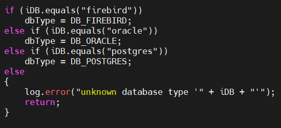
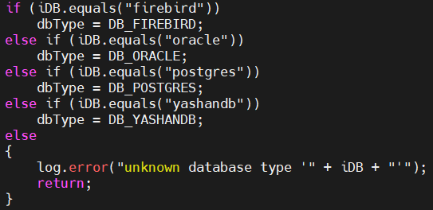
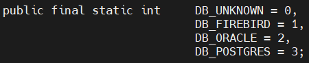
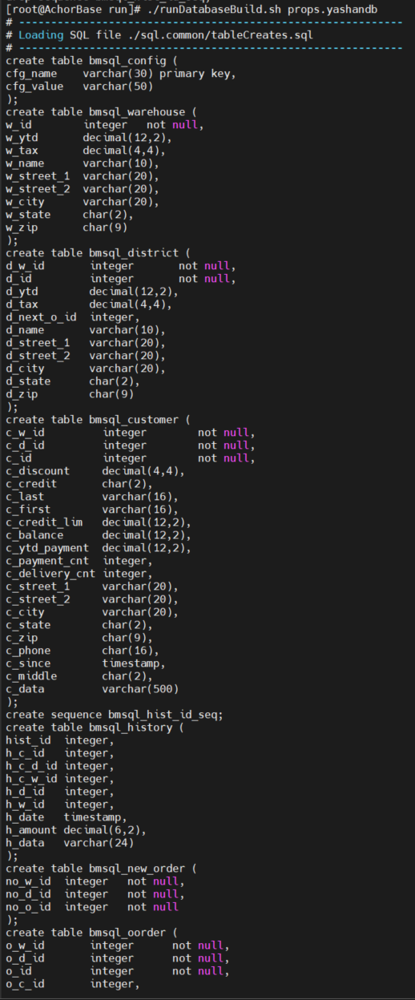

This chapter will introduce the specific operations and related examples of running the BenchmarkSQL-based TPC-C test on a YashanDB standalone database.

## Download TPC-C Testing Tool

- Please download [BenchmarkSQL5](https://sourceforge.net/projects/benchmarksql/) from the official BenchmarkSQL website.
- Ensure that the server has JDK version 1.8 or higher.

## Preparation for TPC-C Testing

Before performing TPC-C testing on YashanDB, it is necessary to configure BenchmarkSQL5 to support the YashanDB database:

### Modify jTPCC.java File

1. Execute the following command in the operating system terminal and enter the password to switch to the root user.
```bash
$ su root
Password:
```

2. Execute the following command to enter the tpc-c directory.
```bash
$ cd tpc-c
```

3. Execute the following command to open the /home/yashan/tpc-c/benchmarksql-5.0/src/client/jTPCC.java file in the vi editor; please pay attention to case sensitivity:
```bash
$ vi benchmarksql-5.0/src/client/jTPCC.java
```

4. Search for the content shown in the image below:



5. Press **i** to enter edit mode, and add the following content after `dbType = DB_POSTGRES`:
```java
else if (iDB.equals("yashandb"))
   dbType = DB_YASHANDB;
```



6. After modification, press **Esc**, enter `:wq` to save and exit the file.

### Modify jTPCCConfig.java File

1. Execute the following command to open the jTPCCConfig.java file in the vi editor:
```bash
$ vi benchmarksql-5.0/src/client/jTPCCConfig.java
```

2. Search for the content shown in the image below:



3. Press **i** to enter edit mode and change that section to the following content:
```java
public final static int DB_UNKNOWN = 0,
			DB_FIREBIRD = 1,
			DB_ORACLE = 2,
			DB_POSTGRES = 3,
			DB_YASHANDB = 4;
```

4. After modification, press **Esc**, enter `:wq` to save and exit the file.

### Compile Source Code

Execute the following commands to enter the benchmarksql-5.0 directory and compile using the ant command:

```bash
$ cd benchmarksql-5.0
$ ant
Buildfile: /home/yashan/tpc-c/benchmarksql-5.0/build.xml

init:

compile:
   [javac] Compiling 11 source files to /home/yashan/tpc-c/benchmarksql-5.0/build

dist:
   [mkdir] Created dir: /home/yashan/tpc-c/benchmarksql-5.0/dist
   [jar] Building jar: /home/yashan/tpc-c/benchmarksql-5.0/dist/BenchmarkSQL-5.0.jar

BUILD SUCCESSFUL
Total time: 1 second
```

> **Note**:
>
> If it returns `ant: command not found`, you can install the ant compilation tool by executing `yum install ant`.

### Create props.yashandb File

1. Execute the following command to enter the /home/yashan/tpc-c/benchmarksql-5.0/run directory:
```bash
$ cd /home/yashan/tpc-c/benchmarksql-5.0/run
```

2. Execute the following command to create the props.yashandb file using the vi editor:
```bash
$ vi props.yashandb
```

3. Press **i** to enter edit mode and add the following content to the file (it can be modified according to the actual environment):
```bash
db=yashandb
driver=com.yashandb.jdbc.Driver
conn=jdbc:yasdb://localhost:1688/yashandb
user=sys
password=sys
warehouses=10
loadWorkers=2
terminals=10
runTxnsPerTerminal=0
runMins=5
limitTxnsPerMin=0
terminalWarehouseFixed=true
newOrderWeight=45
paymentWeight=43
orderStatusWeight=4
deliveryWeight=4
stockLevelWeight=4
resultDirectory=my_result_%tY-%tm-%td_%tH%tM%tS
osCollectorScript=./misc/os_collector_linux.py
osCollectorInterval=1
```


|Parameter |Meaning |
| --------------------------- | ---------------- |
| db                     | Database, must be the same as the name added in the modified file above |
| driver                 | Driver file, must use the YashanDB JDBC driver |
| conn                   | Connection descriptor, format: `conn=jdbc:yasdb://ip:port/database_name` |
| user                   | Database user      |
| password               | Password of the database user |
| warehouses             | Specifies the number of warehouses for the test, usually 100-1000 warehouses |
| loadWorkers            | Number of concurrent data import workers, usually set to 2-4 times the total CPU thread count |
| terminals              | Number of concurrent business operations, usually set to 2-4 times the total CPU thread count |
| runTxnsPerTerminal     | Fixed number of transactions run per session, usually configured as 0, limited by runMins |
| runMins                | Specifies the duration of the test run, usually 10-30 minutes is recommended |
| limitTxnsPerMin        | Transaction limit per minute, usually set to 0 in stress testing scenarios |
| terminalWarehouseFixed  | Binding mode of session and warehouse, usually set to true |
| newOrderWeight<br>paymentWeight<br>orderStatusWeight<br>deliveryWeight<br>stockLevelWeight | The proportion of the five types of transactions, the sum of all values must be 100<br/> The standard business ratio is configured as 45:43:4:4:4 |
| resultDirectory        | Specifies the directory to store the test results. %tY, %tm, %td, %tH, %tM, and %tS are time format parameters |
| osCollectorScript      | Specifies the script path for the OS collector, usually used to collect statistics on resource usage such as CPU usage, memory usage, disk I/O, etc. |
| osCollectorInterval     | Specifies the run interval of the OS collector script (in seconds) |

4. After modification, press **Esc**, enter `:wq` to save and exit the file.

### Modify funcs.sh File

1. Execute the following command to open the `funcs.sh` file in the vi editor:
```bash
$ vi /home/yashan/tpc-c/benchmarksql-5.0/run/funcs.sh
```

2. Press **i** to enter edit mode and replace the document content with the following:
```java
# ----
# $1 is the properties file
# ----
PROPS=$1
if [ ! -f ${PROPS} ] ; then
    echo "${PROPS}: no such file" >&2
    exit 1
fi

# ----
# getProp()
#
#   Get a config value from the properties file.
# ----
function getProp()
{
    grep "^${1}=" ${PROPS} | sed -e "s/^${1}=//"
}

# ----
# getCP()
#
#   Determine the CLASSPATH based on the database system.
# ----
function setCP()
{
    case "$(getProp db)" in
        firebird)
            cp="../lib/firebird/*:../lib/*"
            ;;
        oracle)
            cp="../lib/oracle/*"
            if [ ! -z "${ORACLE_HOME}" -a -d ${ORACLE_HOME}/lib ] ; then
                cp="${cp}:${ORACLE_HOME}/lib/*"
            fi
            cp="${cp}:../lib/*"
            ;;
        postgres)
            cp="../lib/postgres/*:../lib/*"
            ;;
        yashandb)
            cp="../lib/yashandb/*:../lib/*"
            ;;
    esac
    myCP=".:${cp}:../dist/*"
    export myCP
}

# ----
# Make sure that the properties file does have db= and the value
# is a database, we support.
# ----
case "$(getProp db)" in
    firebird|oracle|postgres|yashandb)
        ;;
    "") echo "ERROR: missing db= config option in ${PROPS}" >&2
        exit 1
        ;;
    *)  echo "ERROR: unsupported database type 'db=$(getProp db)' in ${PROPS}" >&2
        exit 1
        ;;
esac
```

3. After modification, press **Esc**, enter `:wq` to save and exit the file.

### Add YashanDB Java Connector Driver

Before performing this step, ensure that the YashanDB JDBC driver has been uploaded. In this example, the driver package is located at /home/yashan/yashandb_jdbc/.

Execute the following commands to add the driver:

```bash
$ mkdir -p /home/yashan/tpc-c/benchmarksql-5.0/lib/yashandb/
$ cp /home/yashan/yashandb_jdbc/yashandb-jdbc-1.5-SNAPSHOT.jar /home/yashan/tpc-c/benchmarksql-5.0/lib/yashandb/
```

### Modify runDatabaseBuild.sh File

1. Execute the following command to open the runDatabaseBuild.sh file in the vi editor:

    ```bash
    $ vi /home/yashan/tpc-c/benchmarksql-5.0/run/runDatabaseBuild.sh
    ```

2. Search for the content shown in the image below:

    ```bash
    ARTER_LOAD="indexCreates foreignKeys extraHistID buildFinish"
    ```

    Please make the following modifications:

    ```bash
    AFTER_LOAD="indexCreates foreignKeys buildFinish"
    ```

3. After modification, press **Esc**, enter `:wq` to save and exit the file.

## Run TPC-C Test

### Deploy YashanDB Database

Optimal performance data may vary due to differences in CPU, memory, I/O, and network conditions in the test environment. To ensure that YashanDB achieves the best TPC-C performance in the testing environment, performance tuning must be conducted according to the test environment configuration. For detailed information on database performance tuning, please refer to the [Optimization Strategy](./Optimization Strategy).

TPC-C test tuning can be primarily divided into parameter configuration tuning and database creation configuration tuning:

**Database Parameter Configuration Tuning**

In the TPC-C test scenario, focus mainly on performance parameters such as buffer size and partition, I/O parameters, etc.

Taking a testing scenario with 1000 warehouses and 256 concurrency as an example, it is recommended to configure the following performance tuning parameters:

```SQL
# Data buffer is used for Data Block Buffer, and its size affects the Buffer hit rate for data access. It is recommended to configure 80% of planned memory as Data Buffer. Best performance is achieved when the Buffer size is greater than total data size.
DATA_BUFFER_SIZE=200G   
# The number of partitions for the Data buffer, in high concurrency testing scenarios, partitioning the Data buffer can reduce Buffer lock conflicts.
_DATA_BUFFER_PARTS=8         
# VM Buffer is used to hold intermediate results for data operations like order/group by. When VM space is insufficient, it can cause memory and SWAP table space swapping, affecting database performance.
# Therefore, a reasonable VM Buffer size must be configured to avoid swapping. The number of SWAP occurrences can be obtained through the V$VM view's SWAPPED_OUT_BLOCKS field; when it's 0, optimal performance can be achieved.
VM_BUFFER_SIZE=25G     
# The number of partitions for the VM buffer, in high concurrency testing scenarios, partitioning the VM buffer can reduce Buffer lock conflicts.
VM_BUFFER_PARTS=8
# Global large page memory area size needs to be increased in high concurrency testing scenarios to avoid resource shortages.
LARGE_POOL_SIZE=1G
# Global execution memory area size needs to be increased in high concurrency testing scenarios to avoid resource shortages.
WORK_AREA_POOL_SIZE=2G
# Retention time for undo data, used for consistent reads or data flashbacks. In scenarios such as TPC-C small transactions, lowering the undo data retention time can improve the efficiency of undo allocation and enhance database performance.
UNDO_RETENTION=15
# Number of session-level CURSORs, increasing the configuration in high concurrency testing scenarios can eliminate global CURSOR contention.
_SESSION_RESERVED_CURSORS=64
# Incremental checkpoint interval time; the background dirty block flushing may compete for I/O with redo flushing. In scenarios where DATA and redo are deployed on the same disk, lowering the Checkpoint frequency can enhance database performance.
CHECKPOINT_TIMEOUT=900
# Specify the redo log flushing size interval from the Recovery Point that triggers the checkpoint to the current redo log flushing point, usually configured as half the total size of the redo files.
CHECKPOINT_INTERVAL=10G
# Size of shared memory pool, increase the configuration to avoid frequent invalidation of SQL Buffer or metadata Buffer.
SHARE_POOL_SIZE=2G
```

For detailed descriptions of database configuration parameters, please refer to [Configuration Parameters](https://doc.yashandb.com/yashandb-en/23.4.6/en/All-Manuals/Reference-Manual/Configuration-Parameters.html).

**Database Creation Configuration Tuning**

>**Note**:
>
> After installation and deployment, YashanDB will default create an initial database. You can delete the initial database (DROP DATABASE) as needed and create a custom database (not applicable to standalone or enterprise versions of ISC Distributed Cluster Deployment).

When creating a database, focus mainly on the following aspects:

-  Size of redo files: If the redo file configuration is too small, redo chasing may occur in stress testing scenarios, severely impacting database performance. You can determine whether redo chasing occurs by examining the "checkpoint completed" wait events in the V$SYSTEM_EVENT view.
- Size of DATA files: Pre-allocating data space can avoid the impact of dynamic space expansion during database operations on performance. Therefore, to achieve optimal performance, sufficient table space needs to be initialized.

In practical use, you should also adjust the redo files, DATA files, and related configurations in a timely manner; for details, refer to [Database File Management](https://doc.yashandb.com/yashandb-en/23.4.6/en/All-Manuals/Database-Administration/Storage-Management/00Storage-Management.html).

If storage conditions permit, deploy the redo file and data file on separate disks to reduce I/O contention between the two. For a testing scenario with 1000 warehouses and 256 concurrency, the recommended database creation statement is as follows:

```sql
CREATE DATABASE tpcc LOGFILE(
'/data1/redo1' size 20G BLOCKSIZE 512,
'/data1/redo2' size 20G BLOCKSIZE 512,
'/data1/redo3' size 20G BLOCKSIZE 512,
'/data1/redo4' size 20G BLOCKSIZE 512,
'/data1/redo5' size 20G BLOCKSIZE 512,
'/data1/redo6' size 20G BLOCKSIZE 512,
'/data1/redo7' size 20G BLOCKSIZE 512,
'/data1/redo8' size 20G BLOCKSIZE 512,
'/data1/redo9' size 20G BLOCKSIZE 512,
'/data1/redo10' size 20G BLOCKSIZE 512)
UNDO TABLESPACE DATAFILE '/data2/undo' size 10G
SWAP TABLESPACE TEMPFILE '/data2/swap' size 10G
SYSTEM TABLESPACE DATAFILE '/data2/system' size 5G
SYSAUX TABLESPACE DATAFILE '/data2/sysaux' size 5G
DEFAULT TABLESPACE DATAFILE '/data2/users' size 300G;
```

For detailed introductions to database configuration parameters and creation configuration tuning, please refer to [Database Configuration Tuning](./Optimization Strategy).

### Clean Up TPC-C Data

In the /home/yashan/tpc-c/benchmarksql-5.0/run directory, execute the following command to clean up data:

```bash
$ ./runDatabaseDestroy.sh props.yashandb

# ------------------------------------------------------------
# Loading SQL file ./sql.common/tableDrops.sql
# ------------------------------------------------------------
drop table bmsql_config;
drop table bmsql_new_order;
drop table bmsql_order_line;
drop table bmsql_oorder;
drop table bmsql_history;
drop table bmsql_customer;
drop table bmsql_stock;
drop table bmsql_item;
drop table bmsql_district;
drop table bmsql_warehouse;
drop sequence bmsql_hist_id_seq;
```


### Load TPC-C Data

In the directory, execute the following command to import data:

```bash
$ ./runDatabaseBuild.sh props.yashandb

# ------------------------------------------------------------
# Loading SQL file ./sql.common/tableCreates.sql
# ------------------------------------------------------------
create table bmsql_config (
cfg_name    varchar(30) primary key,
cfg_value   varchar(50)
);
create table bmsql_warehouse (
w_id        integer   not null,
w_ytd       decimal(12,2),
w_tax       decimal(4,4),
w_name      varchar(10),
w_street_1  varchar(20),
w_street_2  varchar(20),
w_city      varchar(20),
w_state     char(2),
w_zip       char(9)
);
```



### Run TPC-C Test

Execute the following command to perform the TPC-C test:

```bash
$ ./runBenchmark.sh props.yashandb

20:50:04,561 [main] INFO   jTPCC : Term-00,
20:50:04,563 [main] INFO   jTPCC : Term-00, +-------------------------------------------------------------+
20:50:04,563 [main] INFO   jTPCC : Term-00,      BenchmarkSQL v5.0
20:50:04,563 [main] INFO   jTPCC : Term-00, +-------------------------------------------------------------+
20:50:04,563 [main] INFO   jTPCC : Term-00,  (c) 2003, Raul Barbosa
20:50:04,563 [main] INFO   jTPCC : Term-00,  (c) 2004-2016, Denis Lussier
20:50:04,565 [main] INFO   jTPCC : Term-00,  (c) 2016, Jan Wieck
20:50:04,565 [main] INFO   jTPCC : Term-00, +-------------------------------------------------------------+
```


The tpmC value in the test results represents the number of new orders processed by the system per minute, indicating the maximum throughput of the system. The higher the tpmC value, the better the database performance.