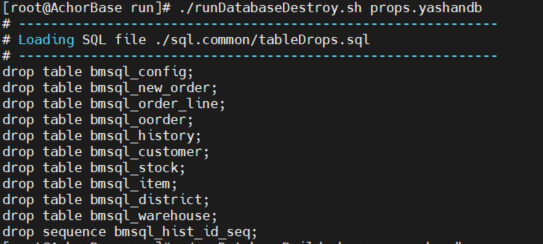
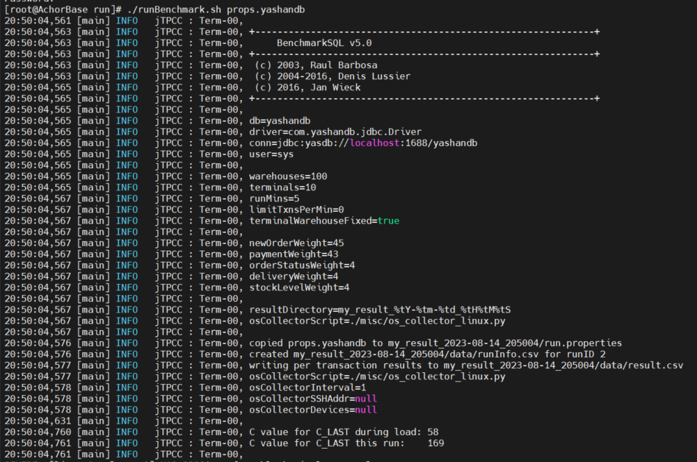

本章节将介绍在YashanDB单机数据库上运行基于BenchmarkSQL的TPC-C测试的具体操作及相关示例。

## TPC-C测试工具下载

- 请自行于BenchmarkSQL官网下载[BenchmarkSQL5](https://sourceforge.net/projects/benchmarksql/)。
- 请确保服务器中已有JDK1.8及以上版本的JDK。

## TPC-C测试准备

对YashanDB进行TPC-C测试前需对Benchmark SQL5进行配置，使之支持YashanDB数据库：

### 修改jTPCC.java文件

1. 在操作系统终端执行如下命令并输入密码，切换至root用户。
```bash
$ su root
Password:
```

2. 执行如下命令，进入tpc-c目录。
```bash
$ cd tpc-c
```

3. 执行如下命令，在vi编辑器中打开/home/yashan/tpc-c/benchmarksql-5.0/src/client/jTPCC.java文件，请注意区分大小写：
```bash
$ vi benchmarksql-5.0/src/client/jTPCC.java
```

4. 在文件中查找下图内容：


5. 按**i**进入编辑模式，在dbType = DB_POSTGRES后新增如下内容：
```java
else if (iDB.equals("yashandb"))
   dbType = DB_YASHANDB;
```


6. 修改完成后，按**Esc**，输入`:wq`保存并退出文件编辑。

### 修改jTPCCConfig.java文件

1. 执行如下命令，在vi编辑器中打开jTPCCConfig.java文件：
```bash
$ vi benchmarksql-5.0/src/client/jTPCCConfig.java
```

2. 在文件中查找下图内容：


3. 按**i**进入编辑模式，将该部分内容修改为如下内容：
```java
public final static int DB_UNKNOWN = 0,
			DB_FIREBIRD = 1,
			DB_ORACLE = 2,
			DB_POSTGRES = 3,
			DB_YASHANDB = 4;
```

4. 修改完成后，按**Esc**，输入`:wq`保存并退出文件编辑。

### 编译源码

执行如下命令进入benchmarksql-5.0目录，并执行ant命令进行编译：

```bash
$ cd benchmarksql-5.0
$ ant
Buildfile: /home/yashan/tpc-c/benchmarksql-5.0/build.xml

init:

compile:
   [javac] Compiling 11 source files to /home/yashan/tpc-c/benchmarksql-5.0/build

dist:
   [mkdir] Created dir: /home/yashan/tpc-c/benchmarksql-5.0/dist
   [jar] Building jar: /home/yashan/tpc-c/benchmarksql-5.0/dist/BenchmarkSQL-5.0.jar

BUILD SUCCESSFUL
Total time: 1 second
```

> **Note**:
>
> 如此时返回`ant:command not found`，可通过执行`yum install ant`安装ant编译工具。

### 创建文件props.yashandb

1. 执行如下命令，进入/home/yashan/tpc-c/benchmarksql-5.0/run目录：
```bash
$ cd /home/yashan/tpc-c/benchmarksql-5.0/run
```

2. 执行如下命令，通过vi编辑器创建文件props.yashandb：
```bash
$ vi props.yashandb
```

3. 按**i**进入编辑模式，将如下内容新增至文件中（可根据实际环境进行修改）：
```bash
db=yashandb
driver=com.yashandb.jdbc.Driver
conn=jdbc:yasdb://localhost:1688/yashandb
user=sys
password=sys
warehouses=10
loadWorkers=2
terminals=10
runTxnsPerTerminal=0
runMins=5
limitTxnsPerMin=0
terminalWarehouseFixed=true
newOrderWeight=45
paymentWeight=43
orderStatusWeight=4
deliveryWeight=4
stockLevelWeight=4
resultDirectory=my_result_%tY-%tm-%td_%tH%tM%tS
osCollectorScript=./misc/os_collector_linux.py
osCollectorInterval=1
```


|  参数| 含义|
| --------------------------- | ---------------- |
| db                        | 数据库，须与上述修改文件中添加的数据库名称相同               |
| driver                    | 驱动程序文件，须使用YashanDB的JDBC驱动                       |
| conn                      | 连接描述符，格式为：`conn=jdbc:yasdb://ip:port/database_name` |
| user                      | 数据库用户                |
| password                  | 数据库用户的密码          |
| warehouses                | 用于指定测试中商品仓库的数量，通常测试场景为100~1000仓       |
| loadWorkers               | 数据导入的并发数，通常设置为CPU线程总数的2~4倍               |
| terminals                 | 业务运行的并发数，通常设置为CPU线程总数的2~4倍               |
| runTxnsPerTerminal        | 每个会话运行的固定事务数量，通常配置为0，以runMins限制测试时间 |
| runMins                   | 用于指定测试运行的时间，通常建议压测时间为10~30分钟          |
| limitTxnsPerMin           | 每秒事务数上限，压测场景下通常设置为0                        |
| terminalWarehouseFixed    | 会话和仓库的绑定模式，通常设置为true                         |
| newOrderWeight<br>paymentWeight<br>orderStatusWeight<br>deliveryWeight<br>stockLevelWeight | 五种事务的占比，所有值的和须为100<br/>标准的业务比率配置为45:43:4:4:4 |
| resultDirectory    	   | 指定存储测试结果的目录。%tY、%tm、%td、%tH、%tM和%tS是时间格式化参数 |
| osCollectorScript    	   | 指定操作系统收集器的脚本路径。通常用于收集操作系统资源使用情况的统计信息，例如CPU使用率、内存使用情况、磁盘I/O等 |
| osCollectorInterval       | 指定操作系统收集器脚本运行间隔（单位：秒）                       |

4. 修改完成后，按**Esc**，输入`:wq`保存并退出文件编辑。

### 修改文件funcs.sh

1. 执行如下命令，在vi编辑器中打开`funcs.sh`文件：
```bash
$ vi /home/yashan/tpc-c/benchmarksql-5.0/run/funcs.sh
```

2. 按**i**进入编辑模式，将文档内容替换为如下内容：
```java
# ----
# $1 is the properties file
# ----
PROPS=$1
if [ ! -f ${PROPS} ] ; then
    echo "${PROPS}: no such file" >&2
    exit 1
fi

# ----
# getProp()
#
#   Get a config value from the properties file.
# ----
function getProp()
{
    grep "^${1}=" ${PROPS} | sed -e "s/^${1}=//"
}

# ----
# getCP()
#
#   Determine the CLASSPATH based on the database system.
# ----
function setCP()
{
    case "$(getProp db)" in
        firebird)
            cp="../lib/firebird/*:../lib/*"
            ;;
        oracle)
            cp="../lib/oracle/*"
            if [ ! -z "${ORACLE_HOME}" -a -d ${ORACLE_HOME}/lib ] ; then
                cp="${cp}:${ORACLE_HOME}/lib/*"
            fi
            cp="${cp}:../lib/*"
            ;;
        postgres)
            cp="../lib/postgres/*:../lib/*"
            ;;
        yashandb)
            cp="../lib/yashandb/*:../lib/*"
            ;;
    esac
    myCP=".:${cp}:../dist/*"
    export myCP
}

# ----
# Make sure that the properties file does have db= and the value
# is a database, we support.
# ----
case "$(getProp db)" in
    firebird|oracle|postgres|yashandb)
        ;;
    "") echo "ERROR: missing db= config option in ${PROPS}" >&2
        exit 1
        ;;
    *)  echo "ERROR: unsupported database type 'db=$(getProp db)' in ${PROPS}" >&2
        exit 1
        ;;
esac
```

3. 修改完成后，按**Esc**，输入`:wq`保存并退出文件编辑。

### 添加yashandb java connector驱动

执行此步骤前须确保已上传YashanDB JDBC驱动，本例中驱动包所在路径为/home/yashan/yashandb_jdbc/。

执行如下命令添加驱动：

```bash
$ mkdir -p /home/yashan/tpc-c/benchmarksql-5.0/lib/yashandb/
$ cp /home/yashan/yashandb_jdbc/yashandb-jdbc-1.5-SNAPSHOT.jar /home/yashan/tpc-c/benchmarksql-5.0/lib/yashandb/
```

### 修改runDatabaseBuild.sh文件

1. 执行如下命令，在vi编辑器中打开runDatabaseBuild.sh文件：

    ```bash
    $ vi /home/yashan/tpc-c/benchmarksql-5.0/run/runDatabaseBuild.sh
    ```

2. 在文件中查找下图内容：

    ```bash
    ARTER_LOAD="indexCreates foreignKeys extraHistID buildFinish"
    ```

    将该部分内容修改如下：

    ```bash
    AFTER_LOAD="indexCreates foreignKeys buildFinish"
    ```

3. 修改完成后，按**Esc**，输入`:wq`保存并退出文件编辑。

## TPC-C测试运行

### 部署YashanDB数据库

最佳性能数据会因为测试环境的CPU、内存、IO、网络条件差异而不同，为了让YashanDB在测试环境上达到最佳的TPC-C性能表现，需要根据测试环境的配置进行性能调优，数据库性能调优的详细信息请查阅[调优思路](调优思路)。

TPC-C测试调优主要分为参数配置调优和建库配置调优：

**数据库参数配置调优**

在TPC-C测试场景下主要关注缓存大小与分区、IO参数等性能参数的配置。

以1000仓、256并发的测试场景为例，推荐配置以下性能调优参数：

```SQL
# Data buffer用于数据块的缓存，其大小会影响数据访问的缓存命中率。建议将规划内存的80%配置为数据缓存区，如果缓存区的大小大于总数据大小可取得最佳性能。
DATA_BUFFER_SIZE=200G   
# Data buffer的分区数，在大并发的测试场景下，将Data buffer分区可以降低缓存区的锁冲突。
_DATA_BUFFER_PARTS=8         
# VM Buffer用于保存例如order/group by等数据运算的中间结果，当VM空间不足时会产生内存与SWAP表空间的换入，影响数据库性能表现。
# 因此需要配置合理的VM Buffer大小以避免换入的产生。通过视图V$VM中的SWAPPED_OUT_BLOCKS字段可以获取SWAP的次数，当为0时可以取到最佳性能。
VM_BUFFER_SIZE=25G     
# VM Buffer的分区数，在大并发的测试场景下，将VM buffer可以降低缓存区的锁冲突。
VM_BUFFER_PARTS=8
# 全局大页内存区大小，在大并发的测试场景下，需要提高配置以避免资源不足。
LARGE_POOL_SIZE=1G
# 全局执行内存区大小，在大并发的测试场景下，需要提高配置以避免资源不足。
WORK_AREA_POOL_SIZE=2G
# undo数据的保留时间，用于一致性读或者数据闪回。对于类似TPC-C小事务的场景下，降低undo数据的保留时间可以提高undo分配效率，提升数据库性能。
UNDO_RETENTION=15
# 会话级CURSOR的数量，在大并发的测试场景下提高配置可以消除全局CURSOR的竞争。
_SESSION_RESERVED_CURSORS=64
# 增量Checkpoint的时间间隔，后台脏块刷盘会与redo刷盘产生IO争用，在DATA和redo同盘部署的场景下，降低Checkpoint频率可以提升数据库性能。
CHECKPOINT_TIMEOUT=900
# 指定触发checkpoint的从恢复点到当前redo日志刷盘点的redo大小间隔，通常配置为redo文件总大小的一半。
CHECKPOINT_INTERVAL=10G
# 共享内存池的大小，提高配置以避免SQL缓存或者元数据缓存的频繁失效。
SHARE_POOL_SIZE=2G
```

数据库配置参数的详细说明请查阅[配置参数](https://doc.yashandb.com/yashandb/23.4.6/zh/All-Manuals/Reference-Manual/Configuration-Parameters.html)。

**数据库建库配置调优**

>**Note**:
>
> 安装部署后，YashanDB将默认创建一个初始数据库，可根据实际需求删除初始数据库（DROP DATABASE）后自定义创建数据库（不适用于标准版或企业版的存算一体分布式集群部署）。

创建数据库时主要关注以下方面：

- redo文件的大小：redo文件配置太小，在压测场景下容易出现redo追尾的情况，严重影响数据库性能。通过V$SYSTEM_EVENT视图中的“checkpoint completed”的等待事件判断是否出现redo追尾的情况。
- DATA文件的大小：预占数据空间可以避免数据库运行过程中空间动态扩展对性能的影响，因此为了最佳性能表现，需要初始化足够大的表空间。

在实际使用过程中，也应及时调整redo文件、DATA文件等相关配置，具体可查阅[文件管理](https://doc.yashandb.com/yashandb/23.4.6/zh/All-Manuals/Database-Administration/Storage-Management/00Storage-Management.html)。

如果存储条件允许，请将redo文件与数据文件分盘部署，以减少两者间的IO争用，以1000仓、256并发的测试场景为例，推荐的建库语句如下：

```sql
CREATE DATABASE tpcc LOGFILE(
'/data1/redo1' size 20G BLOCKSIZE 512,
'/data1/redo2' size 20G BLOCKSIZE 512,
'/data1/redo3' size 20G BLOCKSIZE 512,
'/data1/redo4' size 20G BLOCKSIZE 512,
'/data1/redo5' size 20G BLOCKSIZE 512,
'/data1/redo6' size 20G BLOCKSIZE 512,
'/data1/redo7' size 20G BLOCKSIZE 512,
'/data1/redo8' size 20G BLOCKSIZE 512,
'/data1/redo9' size 20G BLOCKSIZE 512,
'/data1/redo10' size 20G BLOCKSIZE 512)
UNDO TABLESPACE DATAFILE '/data2/undo' size 10G
SWAP TABLESPACE TEMPFILE '/data2/swap' size 10G
SYSTEM TABLESPACE DATAFILE '/data2/system' size 5G
SYSAUX TABLESPACE DATAFILE '/data2/sysaux' size 5G
DEFAULT TABLESPACE DATAFILE '/data2/users' size 300G;
```

数据库配置参数和建库配置调优的详细介绍请查阅[数据库配置调优](调优思路)。

### 清理TPC-C数据

在/home/yashan/tpc-c/benchmarksql-5.0/run目录中，执行如下命令进行数据清理：

```bash
$ ./runDatabaseDestroy.sh props.yashandb

# ------------------------------------------------------------
# Loading SQL file ./sql.common/tableDrops.sql
# ------------------------------------------------------------
drop table bmsql_config;
drop table bmsql_new_order;
drop table bmsql_order_line;
drop table bmsql_oorder;
drop table bmsql_history;
drop table bmsql_customer;
drop table bmsql_stock;
drop table bmsql_item;
drop table bmsql_district;
drop table bmsql_warehouse;
drop sequence bmsql_hist_id_seq;
```



### TPC-C数据装载

目录中执行如下命令进行数据导入：

```bash
$ ./runDatabaseBuild.sh props.yashandb

# ------------------------------------------------------------
# Loading SQL file ./sql.common/tableCreates.sql
# ------------------------------------------------------------
create table bmsql_config (
cfg_name    varchar(30) primary key,
cfg_value   varchar(50)
);
create table bmsql_warehouse (
w_id        integer   not null,
w_ytd       decimal(12,2),
w_tax       decimal(4,4),
w_name      varchar(10),
w_street_1  varchar(20),
w_street_2  varchar(20),
w_city      varchar(20),
w_state     char(2),
w_zip       char(9)
);
```


### 运行TPC-C测试

执行如下语句进行TPC-C测试：

```bash
$ ./runBenchmark.sh props.yashandb

20:50:04,561 [main] INFO   jTPCC : Term-00,
20:50:04,563 [main] INFO   jTPCC : Term-00, +-------------------------------------------------------------+
20:50:04,563 [main] INFO   jTPCC : Term-00,      BenchmarkSQL v5.0
20:50:04,563 [main] INFO   jTPCC : Term-00, +-------------------------------------------------------------+
20:50:04,563 [main] INFO   jTPCC : Term-00,  (c) 2003, Raul Barbosa
20:50:04,563 [main] INFO   jTPCC : Term-00,  (c) 2004-2016, Denis Lussier
20:50:04,565 [main] INFO   jTPCC : Term-00,  (c) 2016, Jan Wieck
20:50:04,565 [main] INFO   jTPCC : Term-00, +-------------------------------------------------------------+
```



测试结果中的tpmC值表示每分钟内系统处理的新订单个数，即系统最大吞吐量。tpmC值常作为性能指标，值越高表示数据库性能越好。
